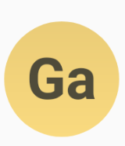

# 🆎 LetterIconView 

[](https://android-arsenal.com/api?level=14) [ ](https://bintray.com/kishannareshpal/maven/lettericonview/1.0.0/link)

LetteredIconView is an android view library to show a letter inside a shape as a view.


It may have a circular, rounded and a square shape.

## Usage

Use it in your xml layout as:
```xml

    <com.kishannareshpal.lettericonview.LetterIconView
            android:layout_width="64dp"
            android:layout_height="64dp"
            app:liv_shape="square"
            app:liv_isGradient="true"
            app:liv_backgroundColor="#EFCB68"
            app:liv_letters="Galantis" />

```

Result: <br>



### XML Attributes

| Attribute                | Type    | Possible Values                                                                                           | 
| ------------------------ | ------- | --------------------------------------------------------------------------------------------------------- |
| app:liv_shape            | enum    | <b>circle<br>round_square<br>square</b>                                                                   |
| app:liv_isGradient       | boolean | <b>true<br>false</b>                                                                                      |
| app:liv_backgroundColor  | color   | any color reference (<b>@color/name</b>) or hex (<b>#EFCB68</b>)                                          |
| app:liv_letters          | string  | any length of string. will only show the first two letters of the string with  the first letter always capitalized. So you might aswell just put a two character string. |

```java

    app:liv_shape // to set the shape of the view. (Default: circle)
    app:liv_isGradient // if you want to use a gradient on the shape's color. (Default: true)
    app:liv_backgroundColor // to manually set the shape color. (Default: a color based on the first letter, 
                            // or lightgrey if the letters attribute is not set)
                            
    app:liv_letters // characters to show inside the shape. (Default: "" – EMPTY)
    // Note: the letters text color will be automatically set to either Light or a Dark color based on the liv_backgroundColor that is set.
        
```


## Installation

Add it via Gradle:
```gradle
    dependencies {
        // ...
        implementation 'com.kishannareshpal:superdialog:<version>'
        // ...
    }
```


## Contributing
Pull requests are welcome. For major changes, please open an issue first to discuss what you would like to change.


## License
[MIT](https://choosealicense.com/licenses/mit/)