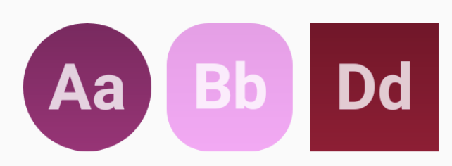
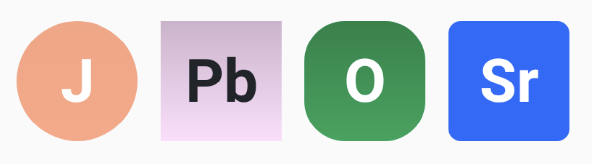
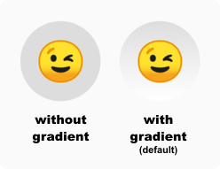
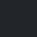

# 🆎 LetterIconView 

[](https://android-arsenal.com/api?level=14) [ ](https://bintray.com/kishannareshpal/maven/lettericonview/1.1.0/link)

LetteredIconView is an android view library to show a letter inside a shape as a view.




It may have a circular, rounded and a square shape.

## Usage

Use it in your xml layout as:
```xml

    <com.kishannareshpal.lettericonview.LetterIconView
            android:layout_width="64dp"
            android:layout_height="64dp"
            app:liv_shape="square"
            app:liv_isGradient="true"
            app:liv_backgroundColor="#EFCB68"
            app:liv_letters="Galantis" />

```

Result: <br>


### XML Attributes
<table style="width:100%">
    <tr>
        <th></th>
        <th>Attribute</th>
        <th>Related Method(s)</th>
        <th>Default value</th>
    </tr>
    <tr>
        <td>
            <b>Shape of the icon</b>
        </td>
        <td>app:liv_shape</td>
        <td>
            <code>setShape</code>
        </td>
        <td>
            <code>circle</code>
        </td>
    </tr>
    <tr>
        <td>
            <b>Background color</b>
        </td>
        <td>app:liv_backgroundColor</td>
        <td>
            <code>backgroundColor</code>
        </td>
        <td>
            <code>#dddddd</code>
        </td>
    </tr>
    <tr>
        <td>
            <b>Background as gradient</b>
        </td>
        <td>app:liv_isGradient</td>
        <td>
            <code>useGradient</code>
        </td>
        <td>
            <code>true</code>
        </td>
    </tr>
    <tr>
        <td>
            <b>Letters</b>
        </td>
        <td>app:liv_letters</td>
        <td>
            <code>letters</code>
        </td>
        <td>
            <code>null</code>
        </td>
    </tr>
    <tr>
        <td>
            <b>Corner radius</b>
        </td>
        <td>app:liv_cornerRadius</td>
        <td>
            <code>cornerRadius</code>
        </td>
        <td>
            <code>0f</code>
        </td>
    </tr>
</table>

<!-- 
```java
    // Description
    app:liv_shape // -> to set the shape of the view. (Default: circle)
    app:liv_isGradient // if you want to use a gradient on the shape's color. (Default: true)
    app:liv_backgroundColor // to manually set the shape color. (Default: a color based on the first letter, 
                            // or lightgrey if the letters attribute is not set)
                            
    app:liv_letters // characters to show inside the shape. (Default: "" – EMPTY)
    // Note: the letters text color will be automatically set to either Light or a Dark color based on the liv_backgroundColor that is set.
        
``` -->

## Examples

### <b>Use different shapes.</b>



For this, you may use the <code>setShape(Shape)</code> method or via XML as:

```xml
    <!-- Circle shape (default) -->
    <com.kishannareshpal.lettericonview.LetterIconView
            android:layout_width="64dp"
            android:layout_height="64dp"
            app:liv_shape="circle" />
```
```xml
    <!-- Square shape -->
    <com.kishannareshpal.lettericonview.LetterIconView
            android:layout_width="64dp"
            android:layout_height="64dp"
            app:liv_shape="square" />
```
```xml
    <!-- Round square shape -->
    <com.kishannareshpal.lettericonview.LetterIconView
            android:layout_width="64dp"
            android:layout_height="64dp"
            app:liv_shape="round_square" />
```
```xml
    <!-- Custom radius shape
         - Use app:liv_cornerRadius to set the desired radius,
           when using custom_radius as shape.

         - The cornerRadius value should be a float between 0 to 100.
           The greater it is, the rounder it becomes. 
           100 makes the shape circular if layout_width and layout_height
           are set to the same values.
     -->
    <com.kishannareshpal.lettericonview.LetterIconView
            android:layout_width="64dp"
            android:layout_height="64dp"
            app:liv_shape="custom_radius"
            app:liv_cornerRadius="20" />
```

<br>

### <b>Change the shape's background color</b><br>
The view automatically chooses a background color for you according to the first character of the ```letters``` attribute.<br>
Otherwise the background color will default to ```#dddddd```, if the letter's attribute is null/empty or if the first character is non-english.

You can overwrite the color you want using the <code>backgroundColor(int)</code> or via the <code>app:backgroundColor</code>.


```xml
    <!-- Color is automatically set depending on the
         first character of the letters.
     -->
    <com.kishannareshpal.lettericonview.LetterIconView
        android:layout_width="64dp"
        android:layout_height="64dp"
        app:liv_letters="Ab" />
```

```xml
    <!-- The colors are unique for every character 
         from A to Z.
     -->
    <com.kishannareshpal.lettericonview.LetterIconView
        android:layout_width="64dp"
        android:layout_height="64dp"
        app:liv_letters="Bc" />
```

```xml
    <com.kishannareshpal.lettericonview.LetterIconView
        android:layout_width="64dp"
        android:layout_height="64dp"
        app:liv_letters="De" />
```

```xml
    <!-- When the first character of the letters is not
         english (or it's null/empty), than the background 
         color will default to #dddddd, unless you specify
         a background color of your own.
     -->
    <com.kishannareshpal.lettericonview.LetterIconView
        android:layout_width="64dp"
        android:layout_height="64dp"
        app:liv_letters="😉" />
```

```xml
    <!-- You may specify the color of your own for an 
         individual view
     -->
    <com.kishannareshpal.lettericonview.LetterIconView
        android:layout_width="64dp"
        android:layout_height="64dp"
        app:liv_letters="De"
        app:liv_backgroundColor="#2943FF" />
```



```xml
    <!-- By default the color of the background will be a linear gradient 
         from top to bottom of the choosen backgroundColor with a lighter 
         version of it.
        
         You can disable the gradient effect by setting the 
         isGradient attribute to false.
     -->
    <com.kishannareshpal.lettericonview.LetterIconView
        android:layout_width="64dp"
        android:layout_height="64dp"
        app:liv_letters="😉"
        app:liv_isGradient="false"  />
```

<br>

### <b>Change the letter shown on top of the shape</b><br>
Use the <code>letters(String)</code> method or the <code>app:liv_letters</code> attribute with XML. Will only show the first two character of the string, capitalized.

• The text font used is the default app font.<br>
• The text color is automatically set to white (<code>#FFFFFF</code> - <code>[]</code>) or a very dark grey (<code>#212529</code> - <code>[]</code>) depending on the background color.


```xml
    <!--
        Only shows the first two characters, 
        with the first one uppercase.
    -->
    <com.kishannareshpal.lettericonview.LetterIconView
        android:id="@+id/letterIconView"
        android:layout_width="64dp"
        android:layout_height="64dp"
        app:liv_letters="Madeira" />
```


## Installation

Add it via Gradle:
```gradle
    dependencies {
        // ...
        implementation 'com.kishannareshpal:lettericonview:<version>'
        // ...
    }
```


## Contributing
Pull requests are welcome. For major changes, please open an issue first to discuss what you would like to change.


## License
[MIT](https://choosealicense.com/licenses/mit/)
